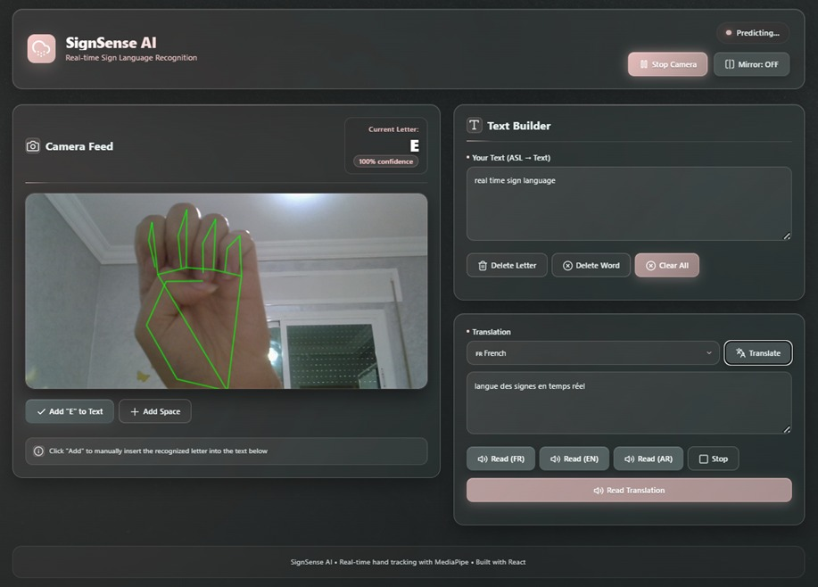
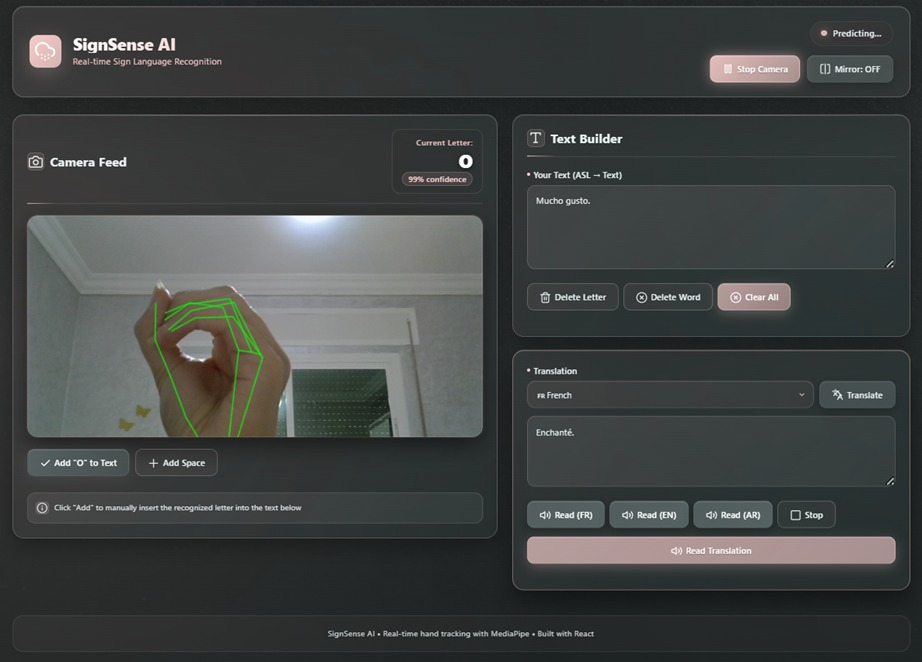

# ASL Sign Language Recognition System

An end-to-end Deep Learning and Computer Vision system for real-time recognition of American Sign Language (ASL) alphabet gestures.

The application detects hand landmarks from a live camera feed, transforms them into a normalized skeletal representation, classifies ASL letters using a trained Deep Learning model, and allows users to build, translate, and vocalize text through an interactive web interface.

---

## Overview

Automatic sign language recognition is a challenging Computer Vision problem due to variations in hand position, orientation, lighting conditions, user morphology, and similarities between certain gestures.

The objective of this project was to design and evaluate a complete real-time ASL recognition system, from dataset collection and preprocessing to Deep Learning experimentation, model evaluation, backend integration, and interactive web deployment.

Several Deep Learning architectures were implemented and compared to identify the best trade-off between:

- Classification accuracy
- Inference speed
- Model complexity
- Real-time stability
- Deployment efficiency

The final system combines **MediaPipe, TensorFlow/Keras, FastAPI, React, and REST APIs** in a modular client-server architecture.

---

## Key Features

- Real-time ASL alphabet recognition
- Hand landmark detection using MediaPipe
- Skeleton-based hand representation
- Custom dataset collection from webcam
- Multiple Deep Learning model comparison
- Real-time confidence score visualization
- Manual validation of recognized letters
- Interactive sentence construction
- Multilingual text translation
- Text-to-speech functionality
- Non-blocking camera processing
- REST API communication between frontend and backend

---

## System Architecture

The application follows a modular client-server architecture.


### Frontend

The frontend is developed with **React** and is responsible for:

- Camera control
- Real-time hand tracking
- MediaPipe landmark extraction
- Skeleton visualization
- Prediction display
- Confidence score visualization
- Text construction
- Translation controls
- Speech synthesis controls

### Backend

The backend is implemented using **FastAPI** and provides REST services for:

- Receiving processed hand representations
- Applying preprocessing
- Running Deep Learning inference
- Returning predictions and confidence scores
- Supporting translation functionality

The frontend and backend communicate through HTTP requests and JSON responses.

---

## Machine Learning Pipeline

### 1. Dataset Collection

The dataset was collected manually using a webcam.

For each ASL letter, multiple gesture samples were captured and organized into their corresponding classes.

Hand detection was performed using `cvzone`, based on **MediaPipe Hands**, which extracts the **21 anatomical landmarks** of the detected hand.

This process provided a structured dataset specifically adapted to the target recognition problem.

### 2. Skeleton Representation

Instead of relying only on raw camera images, the system generates a skeletal representation of the detected hand.

The hand landmarks are projected onto a fixed white background, where:

- Hand joints are represented as points
- Connections between landmarks represent fingers and the palm
- Irrelevant background information is removed

This representation reduces sensitivity to background variations and lighting while preserving the essential geometric information of each gesture.

### 3. Data Preprocessing

Before model training, the images are standardized through several preprocessing operations:

- Resize to `64 × 64` pixels
- Grayscale conversion
- Pixel normalization
- Dataset organization by ASL class
- Train / validation / test splitting
- Controlled data augmentation for selected experiments

For one of the experiments, the dataset was divided into:

- 70% training
- 15% validation
- 15% testing

Light rotation augmentation was also applied to improve robustness to hand orientation.

---

## Deep Learning Models

Several Deep Learning architectures were implemented and evaluated using both custom CNNs and transfer learning.

### Model Comparison

| Model | Framework | Test Accuracy | Main Characteristics |
|---|---|---:|---|
| CNN PyTorch v1 | PyTorch | 99.70% | Lightweight architecture with strong real-time performance |
| CNN PyTorch v2 | PyTorch | 98.76% | Data augmentation and improved robustness to orientation changes |
| Sequential CNN | TensorFlow / Keras | **99.79%** | Best balance between accuracy, speed, simplicity, and deployment |
| ResNet50 | PyTorch / Transfer Learning | 99.25% | Strong generalization but higher computational cost |

---

## Selected Model

The **TensorFlow/Keras Sequential CNN** was selected for the final deployment.

It achieved approximately:

> **99.79% test accuracy**

The model was chosen because it provided the best compromise between:

- High classification accuracy
- Low inference latency
- Lightweight architecture
- Stable continuous prediction
- Easy integration with FastAPI
- Suitability for real-time use

Although ResNet50 also achieved strong performance, its larger architecture and higher computational cost made it less suitable for the lightweight real-time application.

---

## Real-Time Recognition Workflow

During application execution, the recognition pipeline follows these steps:

```text
Camera Feed
    |
    v
MediaPipe Hand Detection
    |
    v
21 Hand Landmarks
    |
    v
Skeleton Representation
    |
    v
Preprocessing
    |
    v
FastAPI Request
    |
    v
Keras CNN Inference
    |
    v
Predicted ASL Letter
    |
    v
Confidence Score
    |
    v
Manual Validation
    |
    v
Text Construction
```

The user remains in control of the final generated text by explicitly validating each detected letter.

---

## Real-Time Performance Optimization

During the first implementation, synchronous requests between the frontend and backend caused the camera stream to become blocked during inference.

To solve this issue, a non-blocking strategy was introduced.

The system:

- Limits the frequency of prediction requests
- Prevents multiple simultaneous inference requests
- Keeps camera rendering independent from backend response time
- Maintains stable real-time interaction during prolonged use

This optimization significantly improved the responsiveness of the application.

---

## Manual Prediction Validation

Recognized letters are not automatically inserted into the generated sentence.

Instead, the application displays:

- The predicted letter
- The model confidence score

The user then decides whether the prediction should be added to the text.

This approach helps:

- Reduce errors caused by unstable predictions
- Improve final text reliability
- Give users full control over sentence construction
- Make the system more suitable for real communication scenarios

---

## Application Interface

### Recognition Example — Letter E



The application displays the live camera feed together with the detected hand landmarks, predicted letter, confidence score, text construction interface, translation module, and speech controls.

### Recognition Example — Letter O



The system continuously tracks the hand while allowing users to validate recognized letters and progressively build words and sentences.

---

## Text Builder

The application includes an interactive text construction module.

Users can:

- Add a recognized letter
- Insert spaces
- Delete the last letter
- Delete the last word
- Clear the complete text

This provides flexibility when constructing full sentences from individual ASL predictions.

---

## Translation

Once a sentence has been created, it can be translated into different languages.

The translation functionality is accessed through the backend and allows the generated text to be transformed into a selected target language.

This extends the system beyond gesture recognition and supports multilingual communication.

---

## Text-to-Speech

The application also provides speech synthesis.

Generated or translated text can be read aloud using browser-based speech synthesis capabilities.

This creates a multimodal communication pipeline:

```text
ASL Gesture
    |
    v
Recognized Letter
    |
    v
Generated Text
    |
    v
Translation
    |
    v
Speech Output
```

---

## Technology Stack

### Artificial Intelligence

- Python
- TensorFlow
- Keras
- PyTorch
- Convolutional Neural Networks
- ResNet50
- Transfer Learning

### Computer Vision

- MediaPipe Hands
- OpenCV
- cvzone
- Hand Landmark Detection
- Skeleton Representation

### Backend

- FastAPI
- REST APIs
- JSON
- Python

### Frontend

- React
- JavaScript
- CSS
- MediaPipe

---

## Project Structure

```text
asl-sign-language-recognition-system/
│
├── backend/
│   └── Backend services, model loading and inference
│
├── frontend/
│   └── React interface and real-time hand tracking
│
├── assets/
│   ├── sign-recognition-e.jpeg
│   └── sign-recognition-o.jpeg
│
├── .gitignore
├── README.md
└── package-lock.json
```

---

## Results

The experimental comparison showed that all evaluated models achieved strong classification performance.

The custom CNN architectures were able to reach accuracy levels above 98% while remaining lightweight enough for real-time inference.

The final Keras CNN obtained:

```text
Test Accuracy: 99.79%
```

The project demonstrates that combining skeleton-based hand representations with lightweight Deep Learning architectures can provide highly accurate recognition while maintaining real-time performance.

The final application integrates the complete pipeline:

```text
Dataset Collection
        |
        v
Hand Landmark Extraction
        |
        v
Data Preprocessing
        |
        v
Deep Learning Training
        |
        v
Model Evaluation
        |
        v
FastAPI Deployment
        |
        v
React Interface
        |
        v
Real-Time ASL Recognition
```

---

## Challenges Addressed

Several technical challenges were explored throughout the project:

- Variations in hand position and orientation
- Similarity between certain ASL letters
- Lighting and background variations
- Selection of an appropriate Deep Learning architecture
- Real-time inference constraints
- Frontend-backend synchronization
- Camera blocking during synchronous requests
- Prediction stability
- User control over generated text

---

## Possible Improvements

Future improvements could include:

- Recognition of dynamic ASL gestures
- Word-level recognition
- Continuous sentence-level recognition
- Temporal modeling of gesture sequences
- Larger and more diverse datasets
- Improved robustness across different users
- Improved handling of visually similar signs
- Mobile deployment
- Cloud deployment
- Additional accessibility features

---

## Use Cases

The system can serve as a foundation for several applications:

- Sign language learning
- Communication assistance
- Accessibility tools
- Human-computer interaction
- Deep Learning educational demonstrations
- Real-time gesture recognition research

---

## Academic Context

This project was developed as an academic Deep Learning and Computer Vision project at:

**National School of Applied Sciences of Tetouan — ENSA Tetouan**

The work covered the full lifecycle of an intelligent application:

- Dataset creation
- Data preprocessing
- Deep Learning experimentation
- Model comparison
- Model selection
- Backend development
- Frontend development
- Real-time integration
- User interface design

---

## Contributors

- Aya Ettalbi
- Oujame Biloul
- Ranya Adraou
- Nour El Houda Amaziane
- Amal Afenich

---

## Contact

**Ranya Adraou**  
Big Data & Artificial Intelligence Engineering Student

[LinkedIn](https://www.linkedin.com/in/ranya-adraou-414550346/)  
[GitHub](https://github.com/ranya20)
